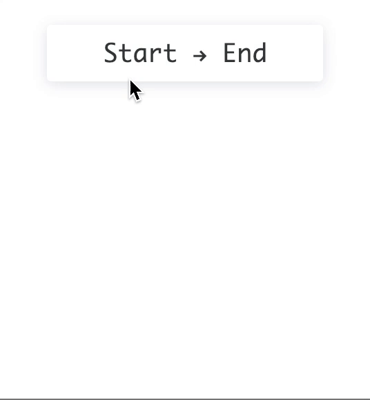

# :calendar: date-picker



## Getting started

### Setup

    $ git clone https://github.com/beneisnr/date-picker.git
    $ cd date-picker
    $ npm i

#### Run demo

    $ npm start
    
### Usage

```
import DatePicker from "./DatePicker";

class App extends Component {

  doSomethingWithDates = (start, end) => {
    // do something with start and end dates
  };

  render() {
    return (
        <DatePicker handleUpdate={this.doSomethingWithDates} />
    );
  }
}
```
